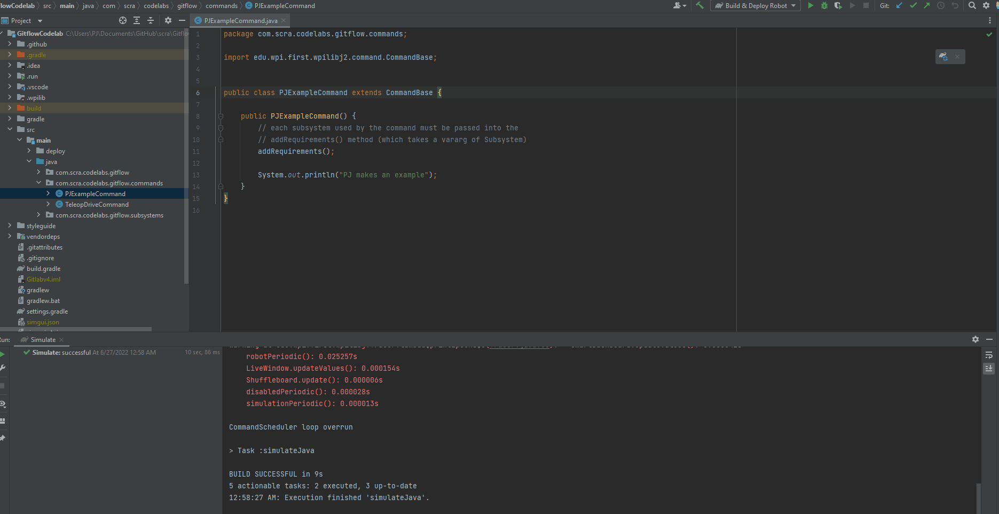

.. _gitflow-lab:

Gitflow Lab
===========

This lab will walk you through our workflow, from creating branches through merging a pull request.

The repository is located at: https://github.com/SteelCityRoboticsAlliance/GitflowCodelab

Part One
________

1. Clone the repository
-----------------------
| Navigate to the repository on _Github. There will be a green button on the right, which will pop open and let you copy the git-friendly URL for cloning the repository.
|
| Then, you will clone (aka download) the repository onto your computer. When doing so, you must select a destination directory. You should put the project in a place that you will remember and be able to find from File Explorer later. 

The recommended location is:

| :code:`C:\Users\<user>\Documents\git\scra\<project_name>` on Windows
| :code:`~/git/scra/<project_name>` on Linux / Mac

.. tabs::

    .. tab:: Intellij

        To clone a repository, click :code:`File -> New -> Project from Version Control`. Paste the URL you copied from github, and select a destination directory.

        |intellij-clone|

    .. tab:: VS Code

        Content 233

2. Checkout a new branch
------------------------
IMPORTANT: For this code lab, you will base your branch off of something other than master. This is to force a merge conflict later in the lab. 99.9% of the time you are developing real code from the robot, you would start off of master

Base the branch off of origin/codelab_start, and name it something like <your name>_codelab_part1

.. tabs::

    .. tab:: Intellij

        You will see your currently selected branc on the bottom right of the IDE. If you click that, you can also switch branches, or create 
        new ones. Normally, you would "Create New Branch" off of :code:`origin/main`, but in this case, base it off of :code:`origin/codelab_start`. 
        Select your new name, and notice that the branch name in the bottom right has changed.

        |intellij-checkout-branch|

    .. tab:: VS Code

        TODO

3. Create a new Subsystem
-------------------------
Create it with the name :code:`<your name>Codelab<year>Part1`, ex. :code:`PJCodelab2020Part1`

4. Put a print line in the constructor
--------------------------------------
Something along the line of :code:`System.out.println("<name> says hello world in <year> part 1");`

5. Create your command
----------------------
In :code:`RobotContainer`, declare your subsystem.

6. Run Simulator
----------------

In this step, we will run the simulator and check that your name was printed out. You can immediatly close out the Simulation Gui when it loads and look to see if your name got printed out. You might have to scroll up in the console logs to see the printouts

.. tabs::

    .. tab:: Intellij

        From the run configurations area, select the :code:`Simulate` task, and hit the green button to run it

        |intellij-simulate|

    .. tab:: VS Code

        TODO

7. Commit, Push, Create PR
--------------------------
You will notice that the you cannot merge your branch, because there is a conflict

.. tabs::

    .. tab:: Intellij

        On the left side of the IDE you will see a "Commits" tab. From here, you can select all the changes you want to commit, write a commit message, then click the "Commit and Push" button

        |intellij-commit-and-push|

    .. tab:: VS Code

        Content 233

8. Fix conflict, re-push
------------------------
After the push, add a SCRA mentor as a reviewer, and ping them in Slack to review and approve the PR

.. tabs::

    .. tab:: Intellij

        TODO

    .. tab:: VS Code

        TODO

Part Two
________
Part two is meant to make sure you run the cleanup process correctly, and can create your next feature branch.

Re-run steps 1-6, but replace any references to "part1" with "part2"

.. |intellij-clone| image:: /git-overview/images/intellij-clone-project.gif

.. |intellij-commit-and-push| image:: /git-overview/images/intellij-commit-and-push.gif
.. |intellij-checkout-branch| image:: /git-overview/images/intellij-checkout-branch.gif
