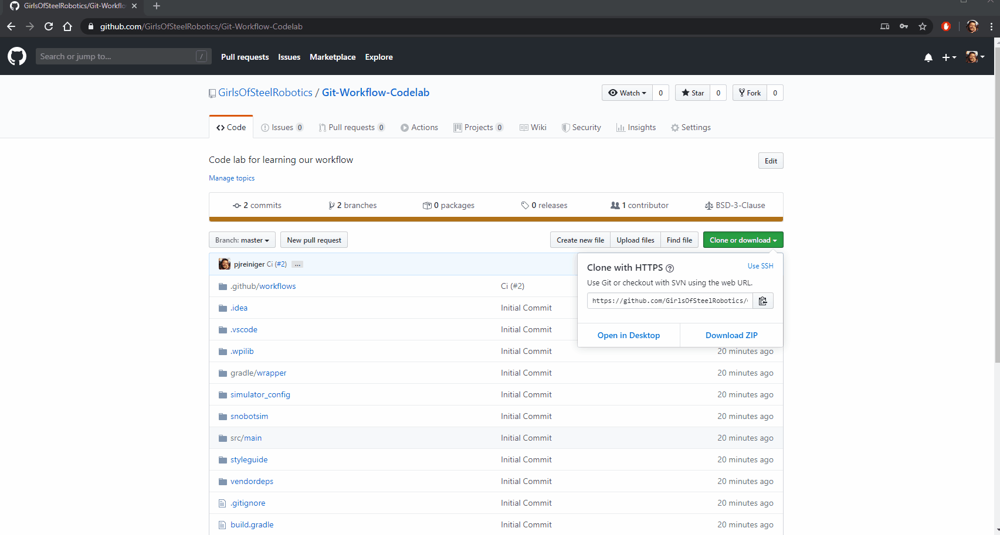
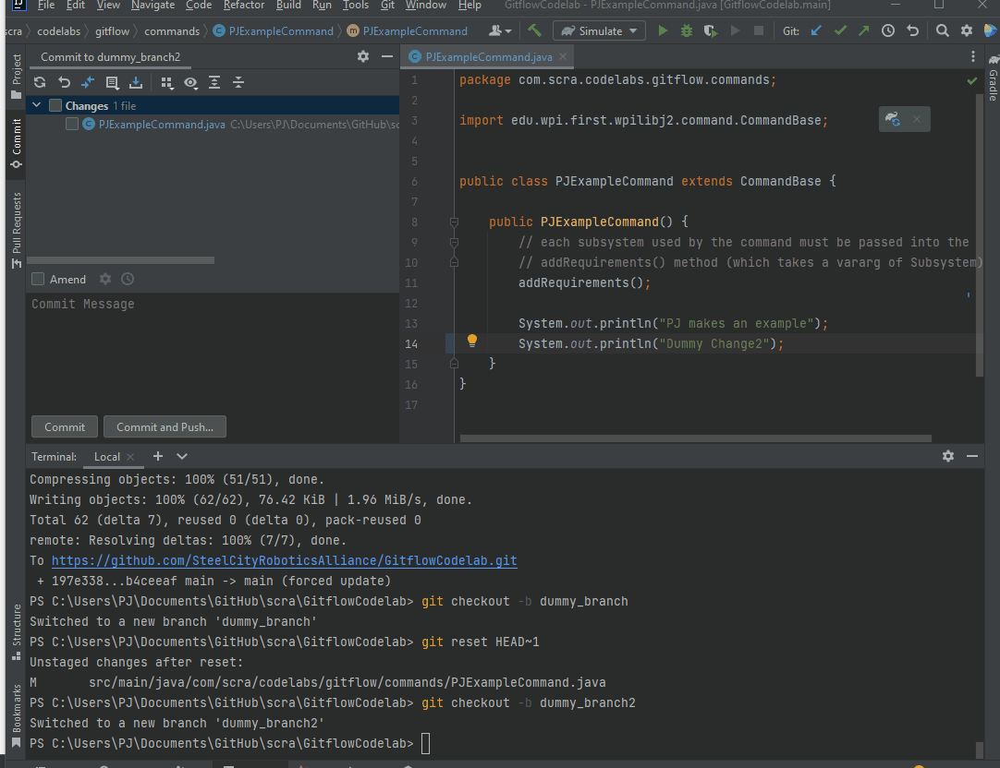
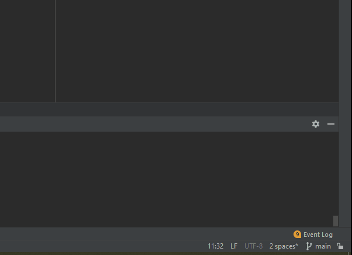
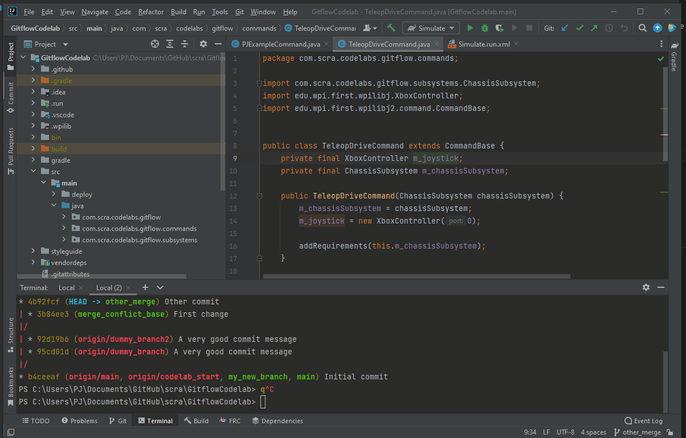
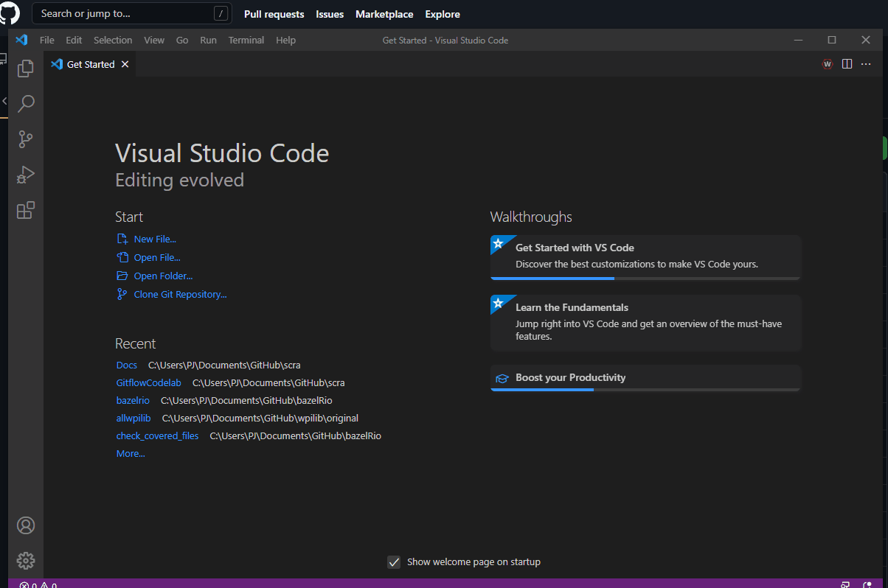
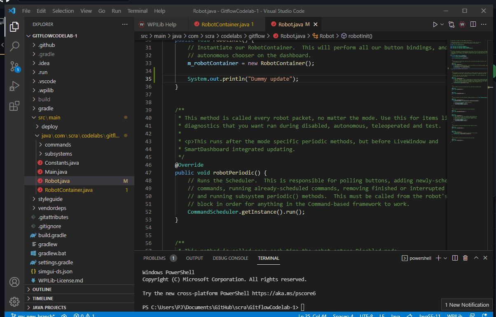
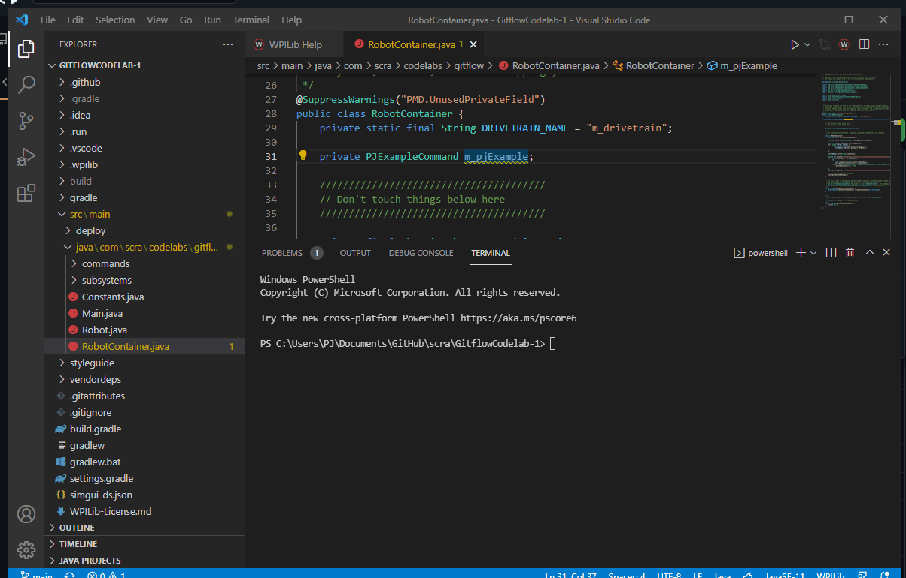
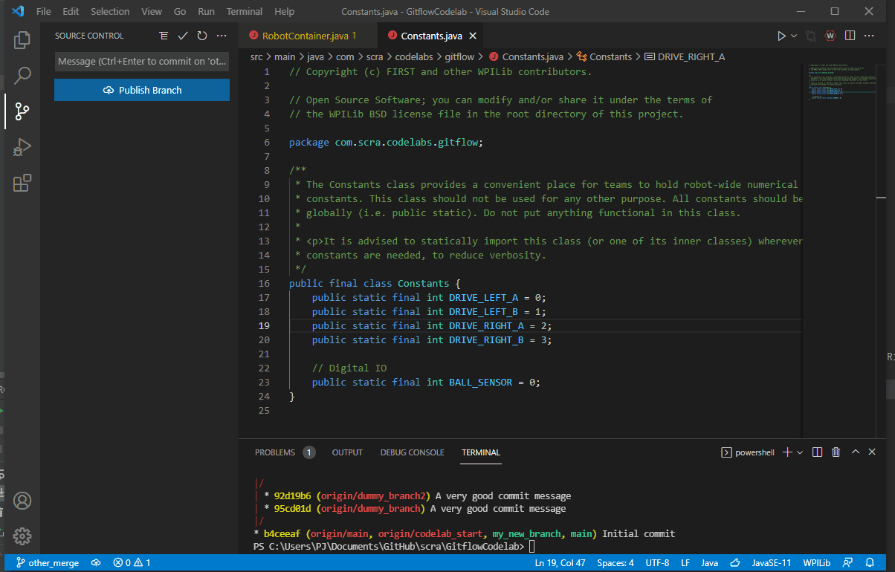

Common Git Actions
==================

1. Cloning a repository
-----------------------
| Cloning is the process of downloading a repository from a remote server (like github.com) onto your computer. It grabs the entire history of the project and all of the branches on the remote.
|
| Navigate to the repository on _Github. There will be a green button on the right, which will pop open and let you copy the git-friendly URL for cloning the repository.
|
| Then, you will clone (aka download) the repository onto your computer. When doing so, you must select a destination directory. You should put the project in a place that you will remember and be able to find from File Explorer later. 

The recommended location is:

| :code:`C:\Users\<user>\Documents\git\scra\<project_name>` on Windows
| :code:`~/git/scra/<project_name>` on Linux / Mac

.. tabs::

    .. group-tab:: Intellij

        To clone a repository, click :code:`File -> New -> Project from Version Control`. Paste the URL you copied from github, and select a destination directory.

        |intellij-clone|

    .. group-tab:: VS Code

        |vscode-clone|

    .. code-tab:: sh

        cd <directory where you want the project>
        git clone <url from github>

2. Checking out a new branch
----------------------------
When you are working on a new feature, you should "checkout" a new branch.

.. tabs::

    .. group-tab:: Intellij

        You will see your currently selected branc on the bottom right of the IDE. If you click that, you can also switch branches, or create 
        new ones. Normally, you would "Create New Branch" off of :code:`origin/main`, but in this case, base it off of :code:`origin/codelab_start`. 
        Select your new name, and notice that the branch name in the bottom right has changed.

        |intellij-checkout-branch|

    .. group-tab:: VS Code

        |vscode-checkout-branch|

    .. code-tab:: sh

        # Checkout a new branch based on your currently checked out branch
        git checkout -b <new branch name>

        # Checkout a new branch based on some other branch
        git checkout -b <new branch name> <parent branch name>

3. Commit and Push
------------------
Committing and pushing are two separate actions, but for our purposes on FRC we will usually do both at at the same time.

Making a "commit" will save a snapshot of the repository.

"Pushing" is the process of publishing our local commits to the remote server (github.com).

.. tabs::

    .. group-tab:: Intellij

        On the left side of the IDE you will see a "Commits" tab. From here, you can select all the changes you want to commit, write a commit message, then click the "Commit and Push" button

        |intellij-commit-and-push|

    .. group-tab:: VS Code

        |vscode-commit-and-push|

    .. code-tab:: sh

        # Add all your changes
        git add *

        # Commit the changes
        git commit -m "<your commit message>"

        # Push the changes
        git push

4. Fixing Conflicts
-------------------
When multiple people are working on the same project, there are times when two people edit the same file in the same place. This causes a "merge conflict", which you must resolve. Sometimes your change should overwrite their change (or vice versa), and sometimes you might actually want to keep both sets of changes. This is highly dependent on what the changes are, and merge conflicts should be handled with great care

.. tabs::

    .. group-tab:: Intellij

        |intellij-merge-conflict|

    .. group-tab:: VS Code

        |vscode-merge-conflict|

        

